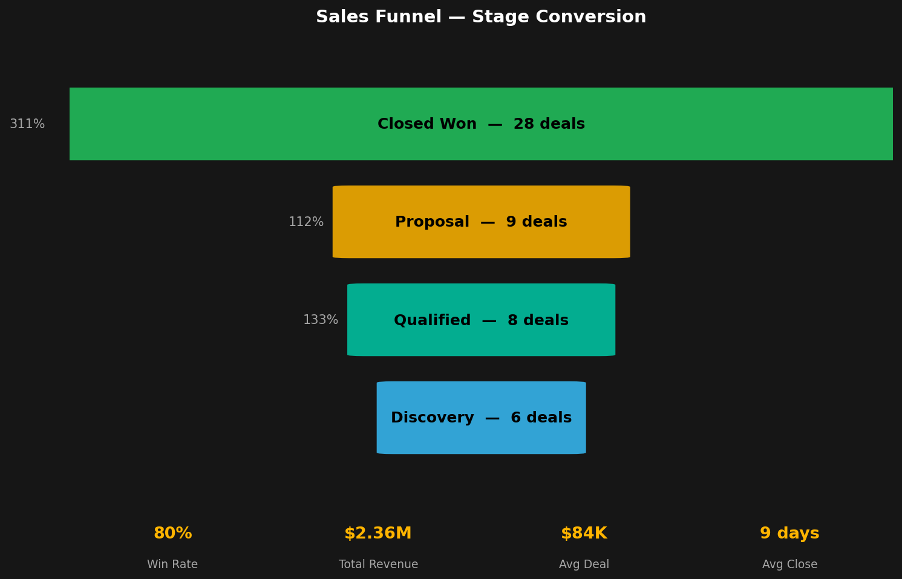
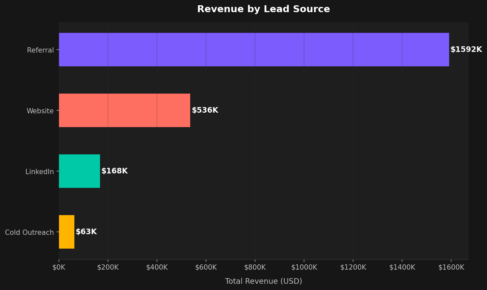
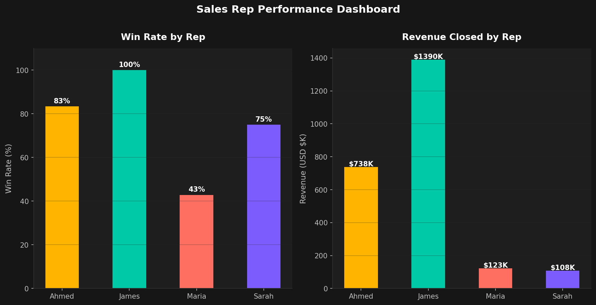
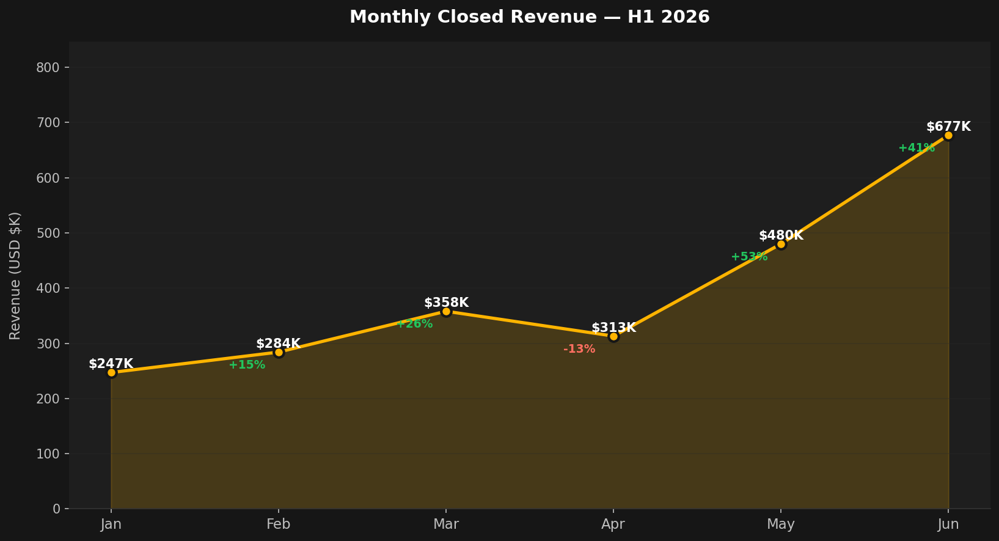

# Sales Funnel Analysis — B2B Pipeline

A Python-based analysis of a B2B sales pipeline covering 58 deals across 6 months (H1 2026). The project surfaces conversion rates at each funnel stage, revenue attribution by lead source, individual rep performance, and monthly revenue trends.

Built as part of my data analytics portfolio to demonstrate end-to-end pipeline analysis using Python.

---

## Key Findings

| Metric | Result |
|--------|--------|
| Total deals analysed | 58 |
| Win rate | 80% |
| Total revenue closed | $2.36M |
| Average deal size | $84,250 |
| Average days to close | 9.3 days |
| Strongest lead source | Referral (67% of revenue) |
| Best month | June ($677K) |

**Top insight:** Referral leads represent 28% of total leads but generate 67% of closed revenue — a 2.4x revenue efficiency advantage over the next best source.

---

## Charts

### 1. Sales Funnel — Stage Conversion


### 2. Revenue by Lead Source


### 3. Rep Performance — Win Rate & Revenue


### 4. Monthly Revenue Trend — H1 2026


---

## Project Structure

```
sales-funnel-analysis/
├── sales_funnel_analysis.py   ← main analysis script
├── sales_funnel_data.csv      ← pipeline dataset (58 deals)
├── chart_1_funnel.png         ← stage conversion funnel
├── chart_2_revenue_by_source.png
├── chart_3_rep_performance.png
├── chart_4_monthly_trend.png
├── thumbnail.png     ← portfolio thumbnail
└── README.md
```

---

## How to Run

**1. Clone the repo**
```bash
git clone https://github.com/shahinkhan-git/sales-funnel-analysis.git
cd sales-funnel-analysis
```

**2. Install dependencies**
```bash
pip install pandas matplotlib seaborn numpy
```

**3. Run the analysis**
```bash
python sales_funnel_analysis.py
```

This generates all 4 charts in the same directory and prints a summary to the terminal.

---

## Dataset

`sales_funnel_data.csv` contains 58 B2B deals with the following fields:

| Column | Description |
|--------|-------------|
| `lead_id` | Unique deal identifier |
| `lead_source` | How the lead was acquired (LinkedIn, Referral, etc.) |
| `stage` | Current pipeline stage |
| `deal_value` | Deal value in USD |
| `days_in_stage` | Time spent in current stage |
| `region` | Geographic region (EMEA, MENA, LATAM) |
| `industry` | Client industry vertical |
| `rep_name` | Sales representative |
| `month` | Month of activity |

---

## Tech Stack

| Tool | Purpose |
|------|---------|
| Python 3.x | Core language |
| Pandas | Data loading, cleaning, aggregation |
| Matplotlib | Chart rendering and styling |
| Seaborn | Statistical visualisation |
| NumPy | Numerical operations |

---

## About

Built by **Shahin Khan** — Data Analyst and Business Development Manager based in Madrid, Spain.

- Portfolio: [shahinkhan.net/portfolio](https://www.shahinkhan.net/portfolio/)
- LinkedIn: [linkedin.com/in/shahin-in](https://www.linkedin.com/in/shahin-in/)
- GitHub: [github.com/shahinkhan-git](https://github.com/shahinkhan-git)

---

## License

MIT License — see [LICENSE](LICENSE) for details.
